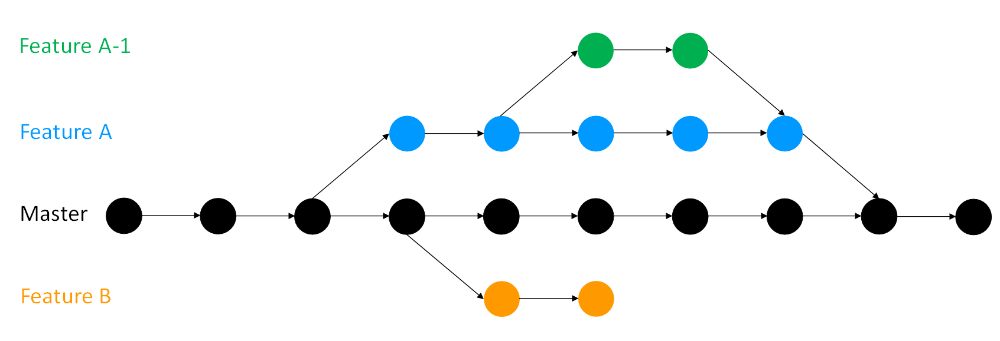

# Git Branches

When working on a project, individually or collaboratively, you may encounter the following scenarios:

-   If you add a new feature to your project, you run the risk of accidentally breaking your working code as you test the feature. This would cause unexpected issues for active users of your project, even if the only active user is you.
-   When you collaborate with others, and everyone works on the main branch simultaneously, there could be a lot of confusion and conflicting changes.
-   Some code/feature might not be interesting for everyone. There may need to be a way to allow new work to be done on a project whilst protecting work that has already been done.

Git branches are extremely valuable when addressing any of these issues.
For every Git project, by default, you have one branch called 'main' where all commits are recorded.
The branching feature of Git allows us to create a copy of a project that we can work on and continue to make commits to without integrating them into the main branch right away.
Meanwhile, one can continue to make commits on the main branch, which is untouched by the changes made on other branches.
Once you are happy with whatever you were working on on a branch, you can merge it into your main branch (or indeed any other branch).

If you test a feature on a branch that does not work out, you can delete or abandon it (for example, Feature B in the diagram below) rather than spending time unpicking your changes if you were doing all your work on the main branch.
You can have as many branches off of branches as you desire (for example, Feature A-1).

Using branches keeps working code safe, particularly in collaborations.
Each contributor can have their own branch or branches which are only merged into the main project when they are ready.

    You can create a branch and switch to it using:

git checkout -b name_of_your_new_branch

    To change between branches, use the following command:

git checkout name_of_the_branch

    You must commit any work you have in progress before you can to switch to another branch.

    You can see all branches of your project using:

git branch

    This gives the output as a list with an asterisk next to the branch you are on.
    You can also use `git status` if you have forgotten which branch you are on.

    When we are done and we don't need the new branch anymore, we can delete it. The goal end is to integrate all the changes into the `main` branch. Once this has been done then the branch has served its purpose and can be deleted.
    The command to do that is the following:

git branch -d new_branch_name

    If the branches have never been merged to the `main` branch, we will need to write a different command:

git branch -D new_branch_name \`\`\`

## Summary

Git *branching* allows users to experiment with different versions of a project by checking out separate *branches* to work on.

The following commands are useful in the Git branch workflow.

-   `git branch`: Lists all a Git project's branches.
-   `git branch branch_name`: Creates a new branch.
-   `git checkout branch_name`: Used to switch from one branch to another.
-   `git merge branch_name`: Used to join file changes from one branch to another.
-   `git branch -d branch_name`: Deletes the branch specified.

## Good practice

Branches should be used to **keep the main branch clean**.
That is, the main should only contain work which is complete, tested, and rightfully belongs in the main version of the project.
Similarly, you should try to keep individual branches as clean as possible by **only adding one new feature per branch**.
This is because if you are working on several features, some may be finished and ready to merge into main while others are still under development.
Keeping your branches clean means only making changes related to the feature on the feature's branch.
Give your branches **sensible names**, "new_feature" is all well and good until you start developing a newer feature on another branch.

## Interactive tutorial

[Learn Git Branching](https://learngitbranching.js.org/) is a project to provide an interactive way to learn Git.
Going through their tutorials will provide substantial experience with the most commonly used git commands and branch manipulation techniques.
